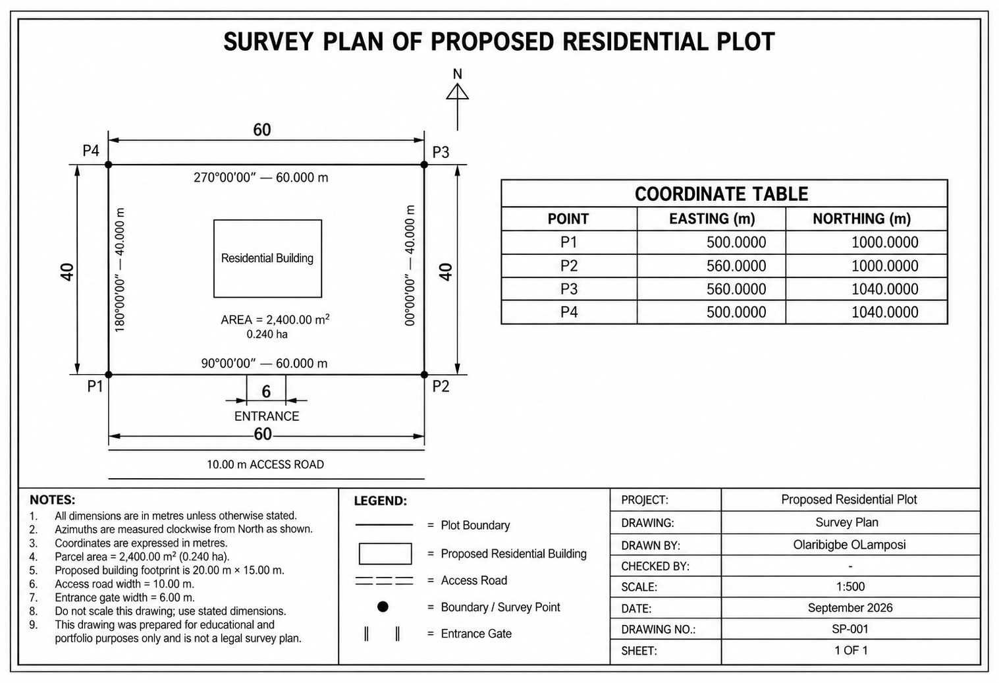

# residential-survey-plan-autocad
Residential survey plan created in AutoCAD using coordinate-based drafting and technical drawing standards.
# Residential Survey Plan — AutoCAD

## Project Overview

This project presents a simulated residential survey plan created in AutoCAD using coordinate-based drafting and technical drawing principles.

The purpose of the project was to practice converting survey coordinates into a complete cadastral-style drawing while developing skills in parcel drafting, azimuth annotation, dimensioning, layer management, layout preparation, and technical presentation.

The final drawing was prepared on an A3 landscape sheet at a scale of 1:500.

---

## Final Drawing

---

## Project Details

- **Software:** AutoCAD
- **Drawing Type:** Residential Survey Plan
- **Sheet Size:** A3 Landscape
- **Scale:** 1:500
- **Parcel Dimensions:** 60 m × 40 m
- **Parcel Area:** 2,400 m²
- **Parcel Area in Hectares:** 0.240 ha
- **Proposed Building Footprint:** 20 m × 15 m
- **Access Road Width:** 10 m
- **Entrance Width:** 6 m

---

## Survey Coordinates

| Point | Easting (m) | Northing (m) |
|------|-------------:|-------------:|
| P1 | 500.000 | 1000.000 |
| P2 | 560.000 | 1000.000 |
| P3 | 560.000 | 1040.000 |
| P4 | 500.000 | 1040.000 |

---

## Boundary Information

Azimuths are measured clockwise from North.

| Boundary | Azimuth | Distance |
|----------|---------|---------:|
| P1 → P2 | 90°00'00" | 60.000 m |
| P2 → P3 | 00°00'00" | 40.000 m |
| P3 → P4 | 270°00'00" | 60.000 m |
| P4 → P1 | 180°00'00" | 40.000 m |

---

## Workflow

The project was completed through the following stages:

1. Set up drawing units and AutoCAD layers.
2. Plotted parcel corner points using Easting and Northing coordinates.
3. Connected the survey points to form the property boundary.
4. Verified parcel dimensions, perimeter, and area.
5. Added point labels, dimensions, and azimuth information.
6. Created a proposed residential building footprint.
7. Positioned and checked building setbacks.
8. Added a 10 m access road and 6 m entrance.
9. Added a north arrow and coordinate table.
10. Prepared notes, legend, and title block.
11. Created an A3 Paper Space layout.
12. Set the viewport scale to 1:500.
13. Prepared the drawing for PDF plotting and portfolio presentation.

---

## AutoCAD Features Used

- Coordinate input
- LINE and POLYLINE
- RECTANGLE
- OFFSET
- MOVE
- Object Snap
- Layers
- MTEXT
- Dimensions
- Distance measurement
- Tables
- Paper Space
- Viewports
- Plotting
- Lineweights
- A3 sheet preparation

---

## Skills Demonstrated

This project demonstrates practical experience with:

- AutoCAD 2D drafting
- Survey plan preparation
- Coordinate-based drawing
- Easting and Northing interpretation
- Azimuths and boundary dimensions
- Parcel area calculation
- Layer management
- Site-plan drafting
- Technical annotation
- Coordinate tables
- Drawing layouts
- Viewport scaling
- Technical drawing presentation

---

## Project Files

The repository contains:

- `Residential_Survey_Plan.dwg` — editable AutoCAD drawing
- `Residential_Survey_Plan_Final.pdf` — final A3 survey sheet
- `Residential_Survey_Plan_Preview.png` — portfolio preview image

---

## Key Learning Outcomes

Through this project, I improved my ability to convert survey coordinate information into a structured AutoCAD drawing and present the result as a professional technical sheet.

I also gained practical experience working between Model Space and Paper Space, setting drawing scales, organizing information using layers, and preparing drawings for plotting.

---

## Disclaimer

This project was created for educational and portfolio purposes using simulated survey data.

It is not a legally certified survey plan and should not be used for land registration, property conveyance, construction, or any official cadastral purpose.

---

## Author

**[Your Name]**

Surveying & Geo-Informatics  
AutoCAD | GIS | Geospatial Analysis
